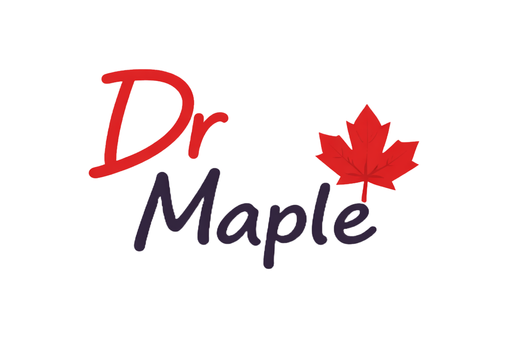
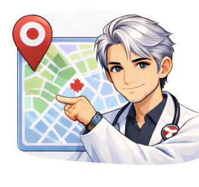

<div align="center">
  
  <br/>
  <h1>Dr. Maple 🍁</h1>
  <h3><em>"The call you make before the call."</em></h3>
  <p>A voice AI health triage assistant built for Canadians.</p>
  <br/>
  
  
  
</div>

---

## 🇨🇦 The Problem We're Solving

Canada's healthcare system is world-class — but it's under enormous strain:

- 🏥 Average ER wait times exceed **4+ hours** in major Ontario hospitals
- 👨‍⚕️ Over **6 million Canadians** don't have a family doctor
- 📞 **811 (Telehealth)** is underutilized — many don't know when it's appropriate to call
- 🌲 Rural and remote Canadians face even greater barriers to timely care

Canadians are left making a difficult, stressful choice every time they feel unwell: *Do I go to the ER? Wait for a walk-in? Call 811? Or just stay home?*

**Dr. Maple** solves this by being your **first point of contact** — an AI health assistant that listens to your symptoms, factors in your wellness data, and gives you a clear, actionable triage recommendation before you decide what to do next.

---

## 🎬 Demo

> *Talk to Dr. Maple. Describe how you feel. Get a clear answer in under 2 minutes.*

<div align="center">
  
</div>

---

## ✨ Features

<div align="center">

| | Feature | Description |
|---|---|---|
| 📞 | **Voice Consultation** | Talk naturally to Dr. Maple — no forms, no typing. Web Speech API captures your voice with Canadian English support. |
| ⌚ | **Apple Watch Sync** | Pair your Apple Watch to send heart rate, sleep, steps, exercise, and activity data directly to Dr. Maple for a richer assessment. |
| 🧠 | **AI Triage (Gemini 2.5)** | Google Gemini synthesizes your symptoms, health history, and wellness data into a structured clinical triage result with Canadian healthcare guidance. |
| 🗺️ | **Clinic Finder** | Google Maps shows every nearby ER, walk-in clinic, and urgent care centre — with estimated wait times and one-tap directions. |
| 📄 | **PDF Health Report** | Every session generates a colour-coded PDF report suitable to bring to a doctor or share with family. |
| 👨‍⚕️ | **Find a Specialist** | Province-by-province links to official College of Physicians and Surgeons registries — find and verify any licensed doctor in Canada. |
| 📋 | **Health History** | All sessions are saved to your account via Firebase. Review past triage results, symptoms, and reports any time. |
| 🗒️ | **Symptom Log** | Track symptoms over time directly in the dashboard — synced to your account so you never lose your history. |
| 🔐 | **Secure Login** | Auth0 authentication keeps your health data private and tied securely to your account. |

</div>

---

## 🏥 How It Works

<div align="center">
  
  &nbsp;&nbsp;&nbsp;
  
  &nbsp;&nbsp;&nbsp;
  
  &nbsp;&nbsp;&nbsp;
  
</div>

<br/>

**Step 1 — Describe Your Symptoms**
Talk to Dr. Maple by voice. No forms, no typing. Just describe how you're feeling, and Dr. Maple will ask follow-up questions — exactly like a real triage nurse.

**Step 2 — Share Your Health Context**
Optionally pair your Apple Watch to send real heart rate, sleep duration, steps, and exercise data. You can also fill in your health profile (age, medications, allergies, medical history) for a more personalized assessment.

**Step 3 — Get Your Triage Result**
Dr. Maple classifies your situation into one of four levels — **Emergency / Urgent / Semi-urgent / Non-urgent** — and tells you exactly what to do: call 911, head to an ER, visit a walk-in, call 811, or rest at home.

**Step 4 — Take Action**
Download a PDF health report, find the nearest clinic on the map, look up a specialist in your province, or simply follow Dr. Maple's advice.

---

## 🛠️ Tech Stack

| Layer | Technology |
|---|---|
| Frontend | React 18 + Vite + TypeScript |
| Styling | Tailwind CSS |
| AI | Google Gemini 2.5 Flash |
| Voice Input | Web Speech API (built-in browser) |
| Voice Output | ElevenLabs TTS |
| Auth | Auth0 (SPA) |
| Database | Firebase Firestore |
| Maps | Google Maps JavaScript API + Places API |
| Apple Watch | Custom iOS companion app → Firebase sync |
| PDF Reports | jsPDF |

---

## 🚀 Quick Start

### 1. Clone & install dependencies

```bash
git clone https://github.com/your-username/dr-nova-hack-canada.git
cd dr-nova-hack-canada
npm install
```

### 2. Set up environment variables

Create a `.env.local` file at the project root and fill in the following:

```env
# Auth0
VITE_AUTH0_DOMAIN=your-domain.us.auth0.com
VITE_AUTH0_CLIENT_ID=your-client-id

# Google Gemini
VITE_GEMINI_API_KEY=your-gemini-api-key

# ElevenLabs
VITE_ELEVENLABS_API_KEY=your-elevenlabs-api-key
VITE_ELEVENLABS_VOICE_ID=your-voice-id

# Google Maps
VITE_GOOGLE_MAPS_API_KEY=your-google-maps-api-key

# Firebase
VITE_FIREBASE_API_KEY=your-firebase-api-key
VITE_FIREBASE_AUTH_DOMAIN=your-project.firebaseapp.com
VITE_FIREBASE_PROJECT_ID=your-project-id
VITE_FIREBASE_STORAGE_BUCKET=your-project.appspot.com
VITE_FIREBASE_MESSAGING_SENDER_ID=your-sender-id
VITE_FIREBASE_APP_ID=your-app-id
```

### 3. Run the dev server

```bash
npm run dev
```

Open [http://localhost:5173](http://localhost:5173)

---

## 🔑 API Keys Setup

| Service | Where to Get It |
|---|---|
| **Auth0** | [auth0.com](https://auth0.com) → Create SPA App → React |
| **Google Gemini** | [aistudio.google.com](https://aistudio.google.com) → Get API Key |
| **ElevenLabs** | [elevenlabs.io](https://elevenlabs.io) → Profile → API Keys |
| **Google Maps** | [console.cloud.google.com](https://console.cloud.google.com) → Enable Maps JS API + Places API |
| **Firebase** | [console.firebase.google.com](https://console.firebase.google.com) → Web App → Firestore |

### Auth0 Setup
1. Create Application → Single Page Application → React
2. In Application Settings, add to **all** URL fields: `http://localhost:5173`
3. Copy Domain and Client ID to `.env.local`

### Firebase Setup
1. Create project → Add Web App → Copy config to `.env.local`
2. Firestore Database → Create database (start in test mode)
3. Add a composite index if prompted: `sessions` collection, `userId ASC` + `timestamp DESC`
4. **Apple Watch companion:** In Firestore Rules, ensure `pairingCodes` allows `create`, and `users/{userId}/appleWatchMetrics` allows write from the iOS app. Test mode allows this by default.

---

## 📁 Project Structure

```
src/
├── pages/          Landing, Call, Dashboard, Report, Profile
├── components/     CallInterface, DoctorAvatar, ClinicMap, LiveVitals,
│                   HealthReport, WaitTimeBadge, WatchCompanionStats, AuthGate
├── hooks/          useGemini, useElevenLabs, useRecorder,
│                   useHealthHistory, useAppleWatchMetrics, useUserProfile
├── services/       gemini, elevenlabs, maps, firebase, report
└── constants.ts    Canadian health resources, triage levels, provincial directories
```

---

## 🍁 Built for Canadians

Every part of Dr. Maple is designed with the Canadian healthcare system in mind:

- **Province-aware resources** — 811 Health Line, Telehealth Ontario, Alberta Health Link, BC Nurse Line, Info-Santé Québec
- **Canadian English** — voice recognition set to `en-CA`
- **Provincial physician directories** — links to all 9 provincial Colleges of Physicians and Surgeons
- **Triage aligned with CTAS** — Canadian Triage and Acuity Scale levels (Emergency → Urgent → Semi-urgent → Non-urgent)
- **Community Health Centre guidance** — follows [Canada.ca recommendations](https://www.canada.ca/en/immigration-refugees-citizenship/services/settle-canada/health-care/find-doctors.html) for finding care

---

## ⚠️ Disclaimer

Dr. Maple is an AI assistant for **triage guidance only**. It is **NOT** a substitute for professional medical advice, diagnosis, or treatment.

- In case of emergency: **call 911 immediately**
- For non-emergency health advice: **call 811** (Ontario / BC / AB) or your provincial telehealth line
- Always consult a licensed healthcare professional for medical decisions

---

<div align="center">
  
  <br/>
  <p>Built with ❤️ for <strong>Hack Canada 2026</strong></p>
  <p><em>Good luck everyone! 🍁</em></p>
</div>
